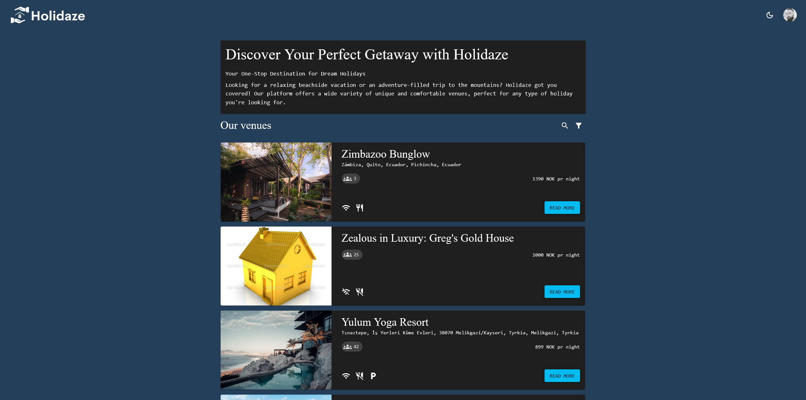

[](https://app.netlify.com/sites/holidaze-ex/deploys)

 Holidaze Accommodation Booking Application



[Live site](https://holidaze-ex.netlify.app/)

## Table of context

- [Introduction](#introduction)
- [Project Brief](#project-brief)
- [Requirements](#requirements)
- [Technical Restrictions](#technical-restrictions)
- [Project Resources](#project-resources)
  - [Project Timeline](#project-timeline)
  - [Design Prototype and Style Guide](#design-prototype-and-style-guide)
  - [Project Management](#project-management)
  - [Repository](#repository)
  - [Live Demo](#live-demo)
- [Installation](#installation)
  - [Prerequisites](#prerequisites)
  - [Installation Steps](#installation-steps)
  - [Available Scripts](#available-scripts)
  - [Dependencies](#dependencies)
- [End to End Testing](#end-to-end-testing)
- [Acknowledgements](#acknowledgements)
- [References](#references)
- [Unsolved issue](#unsolved-issue)
- [Author](#author)

## Introduction

Welcome to the Holidaze Accommodation Booking Application! This project is designed to showcase the development capabilities, visual design skills, and technical expertise acquired over the past two years. Holidaze, a newly launched accommodation booking site, has approached us to develop a brand new front end for their application.

In this project, we will be working with the official API documentation provided by Holidaze to plan, design, and build a modern front-end accommodation booking application. The goal is to create a user-friendly and visually appealing application that allows users to book holidays at various venues and provides an admin-facing interface for managing venues and bookings.

## Project Brief

A newly launched accommodation booking site called **Holidaze** has approached you to develop a brand new front end for their application. While they have a list of required features, the design and user experience has not been specified. Working with the official API documentation, plan, design and build a modern front end accommodation booking application.

There are two aspects to this brief: the customer-facing side of the website where users can book holidays at a venue, and an admin-facing side of the website where users can register and manage venues and bookings at those venues.

## Requirements

The project focuses solely on developing the front-end application that interacts with the existing API managed by Holidaze. The API documentation and resources can be found under Holidaze in the Noroff API documentation.

To ensure a successful implementation, the project has been defined through user stories, which outline the required functionality from both the customer and admin perspectives. Some of the key user stories include:

- Viewing a list of venues
- Searching for a specific venue
- Viewing detailed information about a venue
- Accessing a calendar with available dates for a venue
- Registering as a customer and creating bookings
- Managing bookings and upcoming reservations
- Registering as a venue manager and managing venues
- Updating avatars and logging in/out

## Technical Restrictions

To adhere to the company's technical guidelines, the following restrictions have been set:

- Use of an approved JavaScript framework (React >16)
- Use of an approved CSS framework (Bootstrap >5, Tailwind >3, MUI >5, Styled Components, CSS Modules)
- Hosting the application on an approved static host (GitHub Pages, Netlify)
- Use of an approved design application (Adobe XD, Figma, Sketch)
- Use of an approved planning application (Trello, GitHub Projects)

## Project Resources

To assist you in planning and executing the project, the product owner has requested links to the following resources:

- Gantt chart for project timing
- Design prototype
- Style guide
- Kanban project board
- Repository link
- Hosted application demo link

## Project Timeline

To ensure a smooth development process, a Gantt chart has been prepared to outline the project's timing and milestones. You can find the Gantt chart [here](https://github.com/users/Christonn93/projects/8/views/4).

## Design Prototype and Style Guide

A design prototype has been created to guide the visual and user experience design of the application. You can access the prototype [here](https://github.com/users/Christonn93/projects/8/views/4).

Additionally, a comprehensive style guide has been prepared to maintain consistency throughout the project.

- [Style tile](https://xd.adobe.com/view/87711d66-3c72-4bd2-a168-4249a1c29731-d222/)
- [Prototype Desktop](https://xd.adobe.com/view/b8f06851-3275-4470-86a2-606f44983f53-eda3/)
- [Prototype Mobile](https://xd.adobe.com/view/4fb74c05-a32b-422d-a0df-db3dea40a13d-1ae4/)

## Project Management

To facilitate project management and collaboration, a kanban project board has been set up. You can access the project board [here](https://github.com/users/Christonn93/projects/8/views/1). The board will provide an overview of tasks, their status, and assignment.

## Repository

The project repository can be found [here](https://github.com/Christonn93/holidaze). Feel free to explore the code and contribute to the development.

## Live Demo

A live demo of the Holidaze Accommodation Booking Application is available [here](https://holidaze-ex.netlify.app/). Feel free to test the features and experience the application in action.

We hope you find this project exciting and challenging, and we look forward to seeing your implementation of the Holidaze Accommodation Booking Application!

## Installation

This guide will help you get started with running the This project locally.
Please follow the steps below:

#### Prerequisites

Before you begin, ensure that you have the following software installed on your machine:

- Node.js (version 14 or later)
- npm (Node Package Manager)

#### Installation Steps

1. Clone the repository to your local machine using Git or download the source code as a ZIP file and extract it.

2. Open a terminal or command prompt and navigate to the project directory.

3. Install the project dependencies by running the following command:

```bash
npm install
```

or

```bash
npm i
```

This command will install all the dependencies specified in the package.json file.

4. Create a .env file in the project root directory and add any required environment variables. You can refer to the .env.example file for the required variables. For example, if you have an API_BASEURL variable, your .env file should contain:

```plaintext
REACT_APP_API_BASEURL=http://example.com/api
REACT_APP_GOOGLE_MAP_KEY=API_KEY
```

Make sure to replace <http://example.com/api> with the actual API base URL.
Make sure to replace <API_KEY> with the actual API key.

5. Once the dependencies are installed and the environment variables are set, you can start the development server by running the following command:

```bash
npm start
```

This command will start the development server and the application will be accessible at <http://localhost:3000>.

6. Open your web browser and visit <http://localhost:3000> to see the running React application.

#### Available Scripts

In the project directory, you can use the following npm scripts:

- `npm start`: Starts the development server.
- `npm build`: Builds the production-ready optimized bundle.
- `npm test`: Runs the test scripts.
- `npm run eject`: Ejects the app from the create-react-app configuration.
- `npm run cypress-test`: Runs the Cypress end-to-end tests.
- `npm run test-e2e`: Opens the Cypress test runner for running end-to-end tests.

```md
Please note that some scripts may require additional configuration or setup, 
such as the Cypress tests.
```

That's it! You have successfully installed and started the React project locally. You can now explore and modify the code according to your needs.

If you encounter any issues during the installation process, please refer to the project's documentation or seek support from the project's maintainers.

#### Dependencies

- @emotion/react
- @emotion/styled
- @mui/icons-material
- @mui/x-date-pickers
- @mui/x-date-pickers-pro
- @sweetalert2/theme-material-ui
- @testing-library/jest-dom
- @testing-library/react
- @testing-library/user-event
- axios
- date-fns
- dotenv
- formik
- jsdoc
- react
- react-calendar
- react-date-range
- react-dom
- react-dotenv
- react-hotjar
- react-material-ui-carousel
- react-router-dom
- react-scripts
- styled-components
- google-map-react
- sweetalert2
- web-vitals
- yup

## End to end testing

The project using cypress for end 2 end testing.

```bash
npm run test-e2e
```

## Acknowledgements

- Alexander Barrett [Github](https://github.com/Anclagen)
- Talitha
- Oliver Dipple
- Martin Kruger
- Connor O'Brien
- Jan Henning
- Karl Kvammen

## References

- [React login example](https://javascript.plainenglish.io/basic-react-login-using-external-api-e33322e480cd)
- [Dynamic form fields](https://www.freecodecamp.org/news/build-dynamic-forms-in-react/)
- [MUI](https://mui.com/material-ui/getting-started/overview/)

## Unsolved issue

The is one unsolved issue that I was not able to find a solution to.

Will give a example on the issue i wanted to solve.

```plaintext
You are at all venues, navigating around on the pages. then you find a venue that is interesting at page 10. You navigate in to that venue to read more, then go back to all venues but it brings you back to page 1. not to the page that you was on before going in to the venue to read.
```

For me this is not considered good UX. I tried solving this issue by creating a new path to set `page/{number}` in the url to keep track on what page you are on. Was able to set the number there and make it change on pagination. But not fix the issue with returning to page 1.
I would like to get a example on how to solve this, so I know hot o do it for a later time.

## Author

<div style="display: flex; gap: 20px; align-items: center;">

<h3>Christopher Tønnesland</h3>
</div>
